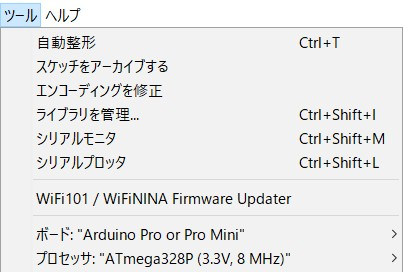

使用方法
==================

ハードウエア
*******************

**仕様**
++++++++++++

===============  ==================  ===========================================
電源               7.5V~35V            MAX20mA@12V 0.24W 　
(電池運用)         2.7V~3.6V           起動中2mA 送信時50mA ｽﾘｰﾌﾟ24μA 
外形               53.5x70x11          ArduinoUno相当
使用可能IO         D0~D8               D0,D1はUSBに接続、JP外して使用可
使用可能ｱﾅﾛｸﾞ       A0~A7
使用環境           -10~70℃            結露無き事          
===============  ==================  ===========================================

 - 電池で運用するときは内部電源、及びUSB回路を切り離す必要があります。
 - ES920LR はｿﾌﾄｼﾘｱﾙで接続され、通信速度は9600bpsに変更済みです。

ソフトウエア
*******************

準備
+++++++++++++++++++

プログラムの作成には、開発環境(Arduino IDE)を使用します。
詳しい説明は致しませんが、たくさん参考になるサイトがあります。
Arduino IDEは、ここからダウンロードしてください。　https://www.arduino.cc/en/software

ライブラリは、GITにあります。　ダウンロードして、インストールしてください。
https://github.com/YasuhiroYano/LoRaFactory

サンプルプログラムも、同じところに保存されています。
 | BoarTrupは、電池運用、LINEメッセージの送信を行っているイノシシ罠のプログラムです。

..  note::
    ﾌﾟﾛｸﾞﾗﾑ時のﾎﾞｰﾄﾞ設定は  AtMega328 3.3V　8MHzを選択します。

子機プログラミング
+++++++++++++++++++++

- ライブラリヘッダ

.. code-block:: cpp

    #include "LoRafactory.h"
    #include <avr/sleep.h>                  // スリープライブラリ
    #include <avr/wdt.h>                    // ウォッチドッグタイマー ライブラリ

sleep.h,wdt.hは、バッテリ運用時に必要となります。

- EASEL ES920LRの使用宣言　(LoRaFactoryｸﾗｽの実体化)

.. code-block:: cpp

    LoRafactory Lf(0, 1, MyID, 2, 3); //End device
    //(cordinator,panid,ownid,receiveNum,transmitNum);

設定内容
 | cordinator　:子機の場合　0
 | panid: 0001 .. 0xfffe 同じIDの機器間でなければ通信できません。 
 | ownid: 0001 .. 0xfffe 自局のidです。　
 | receiveNum,transmitNum: 1..10 送受信のﾃﾞｰﾀ点数です。 この点数内であれば
    簡単にデータの送受信を行うことができます。　後で説明しますが、50byte以内の文字列を送ることもできます。　
　　　
- setup()内で、接続処理を行います。

.. code-block:: cpp

    void setup() {
        Lf.connect(DestId, 3, 10)  ////bw=3(62.5k) sf=10

設定内容
 | DestId：接続先のアドレスで、子機の場合は親機のアドレス０、もしくは中継器のアドレスを設定します。
　　親機での使用の場合は、複数の子機に対して通信を行うことがあるので、この時のDestIdは仮のものでよいです。
 | bw,sf:帯域幅(3..6)は小さいほど、拡散率(7..12)は大きいほど通信距離が延びますが、通信時間が長ります。
 | 詳細については、ES920LRのソフトウエア仕様書を参照ください。

 https://easel5.com/documents/files/ES920LR%E3%82%B3%E3%83%9E%E3%83%B3%E3%83%89%E4%BB%95%E6%A7%98%E3%82%BD%E3%83%95%E3%83%88%E3%82%A6%E3%82%A7%E3%82%A2%E8%AA%AC%E6%98%8E%E6%9B%B8_v121.pdf

 　　　
- loop()内でﾃﾞｰﾀの設定を行います。

.. code-block:: cpp

    Lf.command(cmd);
    Lf.set_data(0, BattVolt);
    Lf.set_data(1, Temp);
    Lf.set_data(2, Flow);

設定内容
 | Lf.command:ﾃﾞｰﾀの識別等に使える1byteの文字を設定
 | Lf.set_data:送信したいデータを宣言LoRafactory Lf(...)で指定した点数まで設定し、送信出来ます。　    
 | データの形式は複数用意しています。　

- データ送信

.. code-block:: cpp

    Lf.transmit();
    delay(10000);

送信が成功すると、Trueが返されます。　　delay()は通信間隔を空けるために必須です。
スリープさせて通信間隔を取る場合は後のバッテリ運用で説明します。

- データ受信

.. code-block:: cpp

    if (Lf.recieve()) {//データを受信
        int id=Lf.recid();  //送信元Id
        int rssi=Lf.rssi(); //受信強度
        char cmd=Lf.command();  //1文字の識別文字
        char *s= get_data(n);   //n番目のﾃﾞｰﾀ
    }

親機プログラミング
+++++++++++++++++++++

- 親機、または中継器として使用する場合の相違点

.. code-block:: cpp

    LoRafactory Lf(1, 1, 0, 2, 3); //End device
    //(cordinator,panid,ownid,receiveNum,transmitNum);

設定内容
 | cordinator　:親機（中央局）１ 
 | panid: 0001 .. 0xfffe 同じIDの機器間でなければ、通信できません。 
 | ownid: 0001 .. 0xfffe 自局のidです。 一般的に親機は0とします。　
 | receiveNum,transmitNum: 1..10 送受信のﾃﾞｰﾀ点数です。 
 
電池運用
+++++++++++++++++++++

子機の場合は、待機時にスリープさせることによって省電力化し、電池で運用できます。
親機の場合は、常に子機からの通信を待ち受ける必要があるので、スリープによる省電力化は出来ません。

- ワッチドックタイマによるスリープからの復帰設定

sleep()でスリープ状態になった後、復帰はワッチドックタイマ(WDT)によって行います。　
WDTは、メインクロックを停止しても動き続ける128KHzのクロックで動作します。
パワーダウンモードの消費電流は、電源電圧4.5Vにおいて27μA以下になります。

.. code-block:: cpp

    void setWdt() {
        MCUSR = 0;
        WDTCSR |= 0b00011000; //WDCE WDE set
        WDTCSR =  0b01000000 | 0b100001;//WDIE set  |WDIF set  scale 8 seconds
        set_sleep_mode(SLEEP_MODE_PWR_DOWN);  // パワーダウンモード指定
        sleep_enable();
    }
    ISR(WDT_vect) {                         // WDTがタイムアップした時に実行される処理
    }

    
- loop() の最後で、スリープモードに移行します

WDTによる復帰時間は、最大8秒ですので処理間隔が長い場合には、復帰回数をカウントして必要な時間間隔
での処理を行います。

.. code-block:: cpp

    void loop() {
        if (++t >= LoopTime) {
            // LoopTime*8秒周期で行う処理
            ADCSRA |= (1 << ADEN); // ADCを許可
            // ADを伴う処理        
            ADCSRA &= ~(1 << ADEN); // ADCを停止（消費電流 147→27μA）
        }
        sleep_mode();//８秒間スリープする
    }

ADCを禁止しないと、3V時200μA、4.5V時270μAが、消費されます。
そのほか入出力ポートは、スリープ前の状態を保持しますので、スリープさせる前に
ポートに電流が流れない状態にする必要があります。

.. warning:: ﾌﾟﾛｸﾞﾗﾑが完成したのちに実際にスリープ時の電流を評価すること。

..  note::

    電池運用でBODをOFFすればさらに待機電流を20μA減らすことができます。
    そのためにはスリープモードの移行をアセンブラで記述する必要があります。
    休止間にBODをOFFにするにはBODSﾋﾞｯﾄが’1’を書かれなければなりません。BODSﾋﾞｯﾄの書き込みはMCUCRのBOD休止許可
    (BODSE)ﾋﾞｯﾄの許可と時間制限手順によって制御されます。関連する休止形態でBODを禁止するには最初にBODSとBODSEの
    両方が’1’を書かれなければなりません。その後4ｸﾛｯｸ周期内にBODSが’1’を、BODSEが’0’を書かれなければなりません。
    BODSﾋﾞｯﾄはそれが設定された後の3ｸﾛｯｸ周期間活性(有効)です。SLEEP命令は実際の休止形態に対してBODをOFFに
    するために、BODSが活性(有効)の間に実行されなければなりません。BODSﾋﾞｯﾄは3ｸﾛｯｸ周期後、自動的に解除(0)されます。

