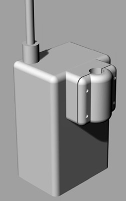

================
 イノシシ罠
================

イノシシの罠の扉にひもを付け、その紐の先につけられたプラグを通報装置に差し込みます。
罠が動作し、プラグが引き出されると、LINEにメッセージを送信します。
本機とは別に、インターネットの環境がある場所に設置されたGatewayが、必要です。
本機とGateWayの距離は周囲の状況によって、2km以上離れることも可能です。

山間部などで直接GateWayに到達できない場合、途中に中継器を設置することで、サービスエリアを拡大できます。
中継器は、太陽電池等を利用して、イノシシ罠からの伝送を常時待ち受ける必要があります。　
[LoRaFactory]はGateWayとしても使用できますし、中継器としても使うことができます。

**仕様**
*************

===============  ==================  ====================================
電源              単4乾電池2本         　1年以上運用可能
LINEメッセージ                         定時通信,電源投入時,捕獲通知
外形              80x130x60           アンテナ、ポール取り付け部分含まず
使用環境	          屋外防滴構造
===============  ==================  ====================================

 - 定時通信　機器が正常であることを通知します。　2日に1回	

 - 電源投入時（バッテリを入れたとき）にも同様に通知します。

 - 捕獲通知　プラグが抜かれたときに通知します。　2分以内	

 （Line NotifyﾄｰｸﾝとメッセージはGateWayのプログラム中で設定します。）	

**シールド**
*************

.. figure:: ../img/boartrup.jpg
   :scale: 50
   :align: Right

イノシシ罠には、リードスイッチを乗せたシールドが、つけられています。　プラグの先には、磁石がつけられています。
ケースの外から、この磁石によって、リードスイッチはONした状態になっています。　プラグが抜かれると、リードスイッチがOFFします。

.. figure:: ../img/Wifi.jpg
   :scale: 100
   :align: Right

- WiFi　GateWay　シールド

LoRaFactoryに、このシールドを重ねたものをGateWayとして、WiFiの有効な場所に設定します。
このシールドに搭載されているWiFiモジュール　`ESP-WROOM-02`_ は、クラウドにデータを送信するプログラムを書き込んだり、
Lineへメッセージを送るプログラムを、書き込むことができます。　

.. _ESP-WROOM-02: https://www.switch-science.com/catalog/2346/