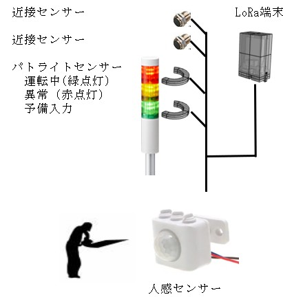

================
工場機械稼働監視
================

[LoRaFactory]の名前からも想像できるように、このIoT基板は工場内でのデータ収集を目的に開発しました。
一般的に工場内では、多数の障害物と電磁ノイズがあり、無線によるデータ収集は簡単ではありません。　
しかし、無線でデータを収集できれば通信線の工事が不要になり、設置費用が大きく削減できます。
PrivateLoRa通信は920MHz帯の電波を使用していてインバータなどの動力機器のノイズを比較的受けにくく、
障害物の影響も少なく,広い工場内でのデータ収集に適しています。
また、多数の機械から稼働情報を収集しようとする場合でも、通信費が必要ありません。

右の例では機械装置自体を改造することなく、ﾊﾟﾄﾗｲﾄの点灯状態を光センサーで取り込むことで稼働状態、
異常の有無などの情報を取得します。　　また、近接ｾﾝｻｰは例えば製品の排出側を監視して生産個数の計数に利用できます。
そして、人感センサーは作業者が作業している時間の把握に利用できます。　ﾓｰﾀの電流を監視することもできます。　
[LoRaFactory]はArduinoUnoと同じ外形で、インターフェイスコネクタは互換があります。　
さらに、電源が7V～35Vと強化されていて一般的な機械制御盤で使用するDC24Vで動かすことができます。
製品のカウントなどの目的に応じたプログラムは　`Arduino`_ IDEで簡単に作ることができます。

[LoRaFactory]からの情報はGateWayにLoRa通信で伝送されます。　
GateWayとして[LoRaFactory]が使用できます。 GateWayとして用意した[LoRaFactory]に、USBでパソコンを直接接続することができます。
WiFi、やLANへのGateWayとする場合はそれらのモジュールが搭載されたシールドを重ねることによって実現できます。

.. _Arduino: https://thinkit.co.jp/story/2013/02/12/3960